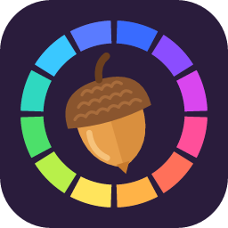
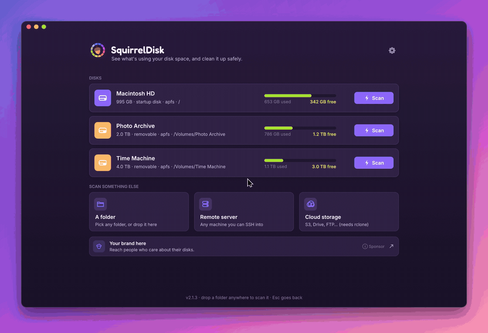
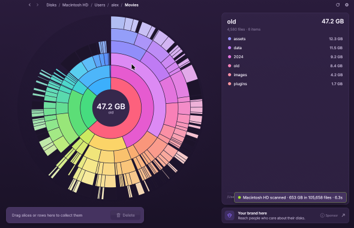
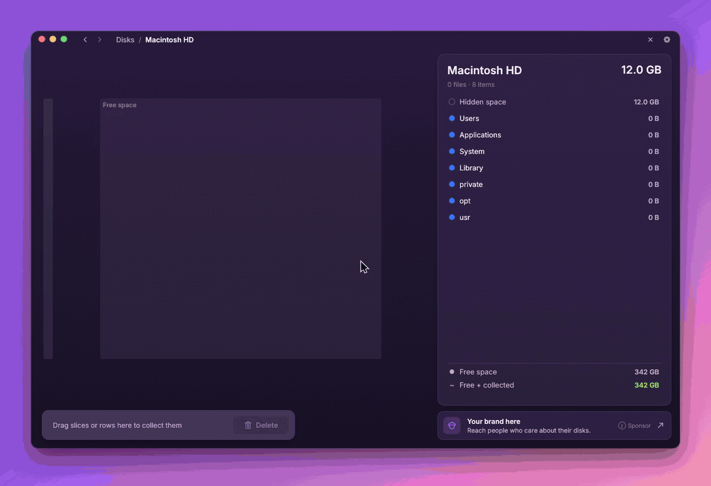
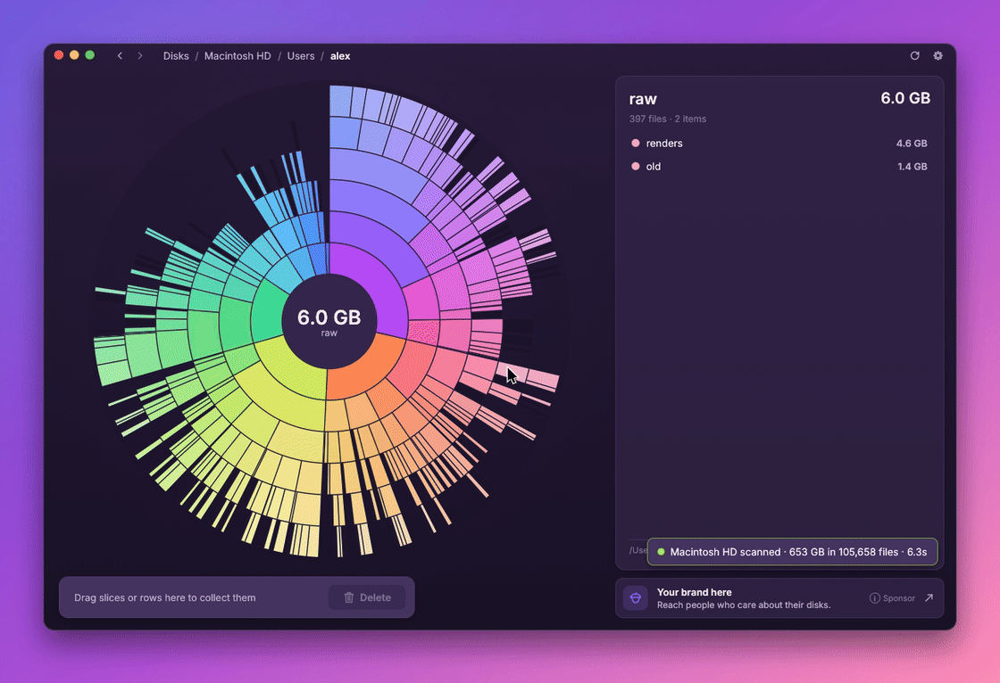
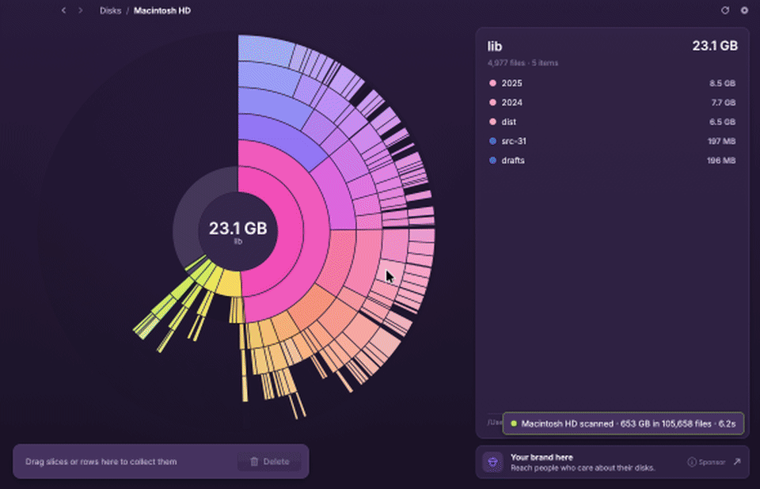
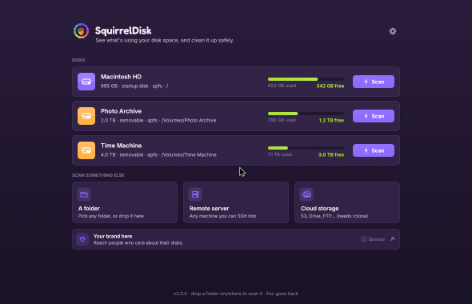
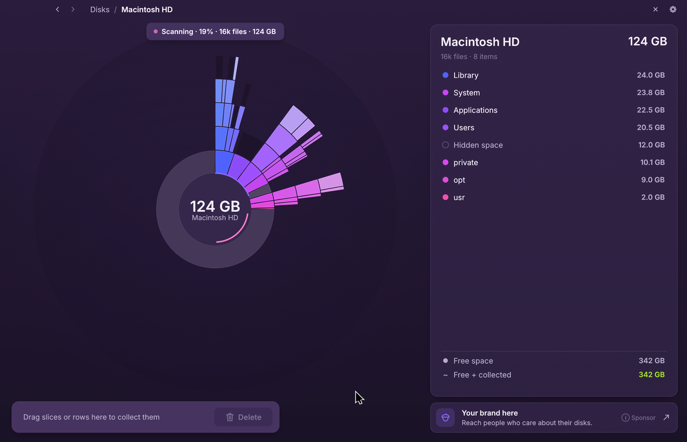
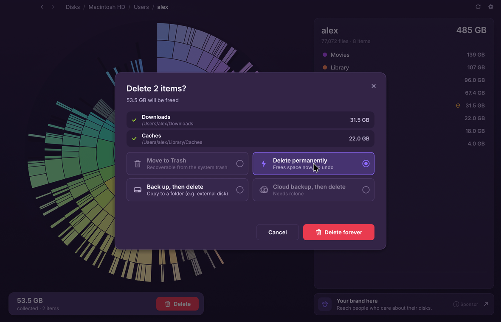
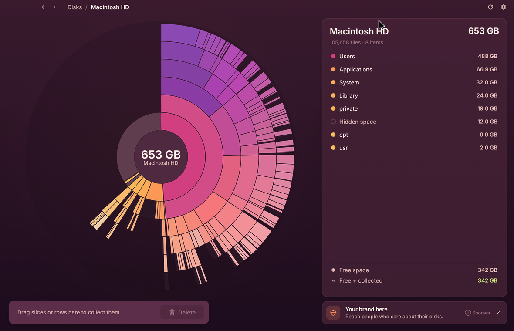

<p align="center">
  
</p>

<h1 align="center">SquirrelDisk</h1>

<p align="center">
  See what's using your disk space, and clean it up safely.<br>
  For macOS, Windows and Linux. Free.
</p>

<p align="center">
  <a href="https://github.com/adileo/squirreldisk/releases/latest"></a>
  <a href="https://github.com/adileo/squirreldisk/releases"></a>
  
  <a href="https://discord.gg/Xp8QtMM65w"></a>
</p>

> [!NOTE]
> **SquirrelDisk 2 is here.** After a few quiet years, SquirrelDisk is back, rebuilt from the ground up by its original author in native Rust: faster, better looking, and with many long-standing bugs fixed on every platform. Completely free, and actively maintained here in this repository.

<p align="center">
  
</p>

## Download

| Platform | Download |
|----------|----------|
| macOS (Apple silicon and Intel) | [SquirrelDisk-macOS.dmg](https://github.com/adileo/squirreldisk/releases/latest/download/SquirrelDisk-macOS.dmg) |
| Windows 10 / 11 | [Installer (.msi)](https://github.com/adileo/squirreldisk/releases/latest/download/SquirrelDisk-Windows.msi) · [Portable (.exe)](https://github.com/adileo/squirreldisk/releases/latest/download/squirreldisk-x86_64-pc-windows-msvc.exe) |
| Linux (x86_64) | [AppImage](https://github.com/adileo/squirreldisk/releases/latest/download/SquirrelDisk-x86_64.AppImage) · [Archive (.tar.gz)](https://github.com/adileo/squirreldisk/releases/latest/download/SquirrelDisk-Linux-x86_64.tar.gz) |

All builds are on the [releases page](https://github.com/adileo/squirreldisk/releases). SquirrelDisk updates itself when a new version comes out.

<details>
<summary>macOS says the app can't be opened</summary>

SquirrelDisk is distributed outside the App Store, so macOS asks for confirmation the first time.

1. Open SquirrelDisk once and close the warning.
2. Go to **System Settings → Privacy & Security**, scroll down and click **Open Anyway** next to the SquirrelDisk message, then confirm.

If macOS reports the app as damaged, run this in Terminal and open it again:

```bash
xattr -dr com.apple.quarantine /Applications/SquirrelDisk.app
```
</details>

<details>
<summary>Windows shows "Windows protected your PC"</summary>

Click **More info**, then **Run anyway**. For the portable `.exe` you can also right-click the file, choose **Properties**, tick **Unblock** and press **OK**.
</details>

## Features

**The whole disk at a glance.** Every folder becomes a slice of a colourful sunburst, sized by the space it takes. The chart builds up live while the scan runs, so the big offenders show up in seconds.

**Explore by clicking.** Click a slice to zoom in, click the centre to go back. Hover any slice and the side list shows what's inside, biggest first. Tiny files are grouped so the chart stays readable, and you can open any group to see everything in it.

<p align="center"></p>

**Sunburst or treemap.** Prefer boxes to rings? Switch to the treemap in Settings: every folder becomes a box inside its parent, with names and sizes, and everything else works the same way.

<p align="center"></p>

**Collect, then clean up.** Drag slices or list rows into the collector at the bottom. When you're ready, move everything to the Trash, delete it for good, or copy it to an external drive or to the cloud first. A progress view keeps you posted, with a little celebration at the end.

<p align="center"></p>

**Secure erase.** When you delete for good, you can have every file overwritten three times with zeros, ones and random data (DoD 5220.22-M) before it's removed.

**Safe by design.** System folders, your home folder, whole drives and other essential locations are protected. App and settings folders ask for an extra confirmation before anything happens.

**Accurate numbers.** SquirrelDisk shows the space files really take on disk. Files that live only in the cloud (iCloud, Dropbox, Google Drive, OneDrive) count as zero, and linked folders are counted once.

**Always up to date.** Delete something in Finder, Explorer or your file manager and the chart updates on its own.

**Servers and cloud storage too.** Scan any machine you can reach over SSH, or S3 buckets, Google Drive, Dropbox, FTP and many more cloud services through [rclone](https://rclone.org). No rclone yet? SquirrelDisk installs it with one click, and you can add, edit and remove your cloud accounts right from the app.

**Light on your machine.** The app is about 8 MB, starts instantly, and maps millions of files with a small amount of memory. It runs smoothly on older computers too.

**Speaks your language.** SquirrelDisk is available in 25 languages, including English, 简体中文, हिन्दी, Español, Français, العربية, Português, Русский, Deutsch, 日本語, 한국어 and Italiano. It picks your system language automatically, and you can change it in Settings.

**Make it yours.** Seven colour themes, optional sound effects, and an adjustable chart depth.

<p align="center"></p>

## Screenshots

<p align="center">
  
  
  
  
</p>

## Sponsors

SquirrelDisk is free, and sponsors help keep it that way. Sponsors appear in a small banner inside the app. The banner is chosen on each user's computer, so personal data stays private.

Interested? Head to [squirreldisk.com/sponsors](https://squirreldisk.com/sponsors).

## Community

- Chat with us on [Discord](https://discord.gg/Xp8QtMM65w)
- Report bugs and suggest ideas in [issues](https://github.com/adileo/squirreldisk/issues)

## Build from source

With [Rust](https://rustup.rs) installed:

```bash
cargo run --release
```

On Linux you also need the ALSA, X11 and Wayland development packages (`libasound2-dev libxkbcommon-dev libwayland-dev libx11-dev` on Debian and Ubuntu).

## License

[AGPL-3.0](LICENSE)
